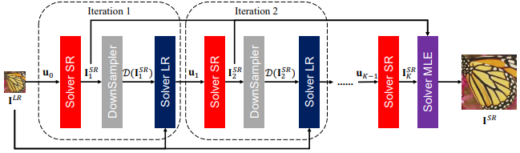
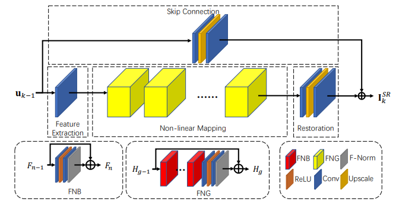
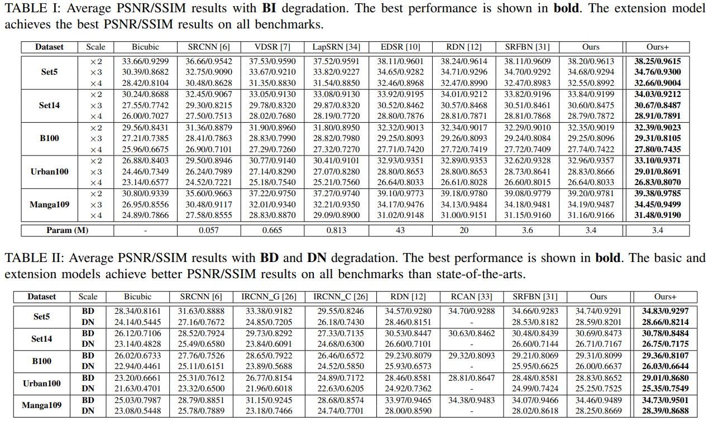

# Iterative Network for Image Super-Resolution

*Yuqing Liu, Shiqi Wang, Jian Zhang, Shanshe Wang, Siwei Ma and Wen Gao. "Iterative Network for Image Super-Resolution"* Accepted by IEEE TMM [IEEExplore](https://ieeexplore.ieee.org/document/9427200)



Network structure



Structure of Solver-SR

Single image super-resolution (SISR), as a traditional ill-conditioned inverse problem, has been greatly revitalized by the recent development of convolutional neural networks (CNN). These CNN-based methods generally map a low-resolution image to its corresponding high-resolution version with sophisticated network structures and loss functions, showing impressive performances. This paper provides a new insight on conventional SISR algorithm, and proposes a substantially different approach relying on the iterative optimization. A novel iterative superresolution network (ISRN) is proposed on top of the iterative optimization. We first analyze the observation model of image SR problem, inspiring a feasible solution by mimicking and fusing each iteration in a more general and efficient manner. Considering the drawbacks of batch normalization, we propose a feature normalization (F-Norm, FN) method to regulate the features in network. Furthermore, a novel block with FN is developed to improve the network representation, termed as FNB. Residual-in-residual structure is proposed to form a very deep network, which groups FNBs with a long skip connection for better information delivery and stabling the training phase. Extensive experimental results on testing benchmarks with bicubic (BI) degradation show our ISRN can not only recover more structural information, but also achieve competitive or better PSNR/SSIM results with much fewer parameters compared to other works. Besides BI, we simulate the real-world degradation with blur-downscale (BD) and downscale-noise (DN). ISRN and its extension ISRN+ both achieve better performance than others with BD and DN degradation models.

## Code
You can easily train and test our model with the MSRN(https://github.com/MIVRC/MSRN-PyTorch) architecture.

## Results



## Citation
Please kindly cite our paper when using this project for your research.
```
@ARTICLE{9427200,
  author={Liu, Yuqing and Wang, Shiqi and Zhang, Jian and Wang, Shanshe and Ma, Siwei and Gao, Wen},
  journal={IEEE Transactions on Multimedia}, 
  title={Iterative Network for Image Super-Resolution}, 
  year={2021},
  volume={},
  number={},
  pages={1-1},
  doi={10.1109/TMM.2021.3078615}}
```
